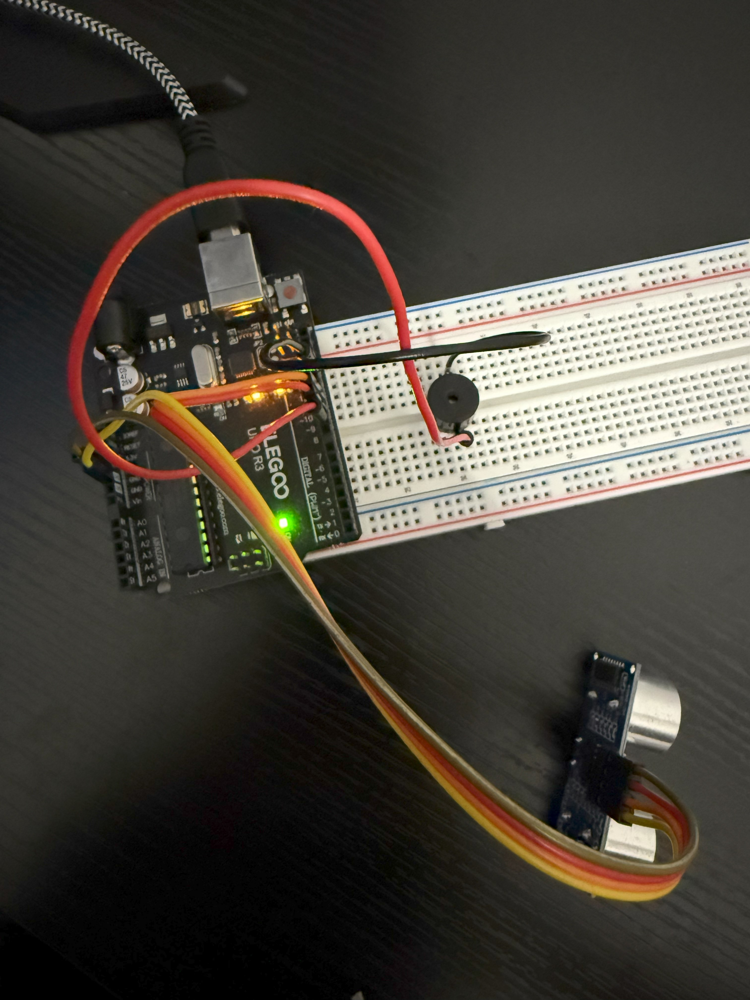

# Arduino Car Reverse Sensor 🚗🔊

This project is an **Arduino-based reverse parking sensor** that uses an ultrasonic sensor (HC-SR04) to measure distance and a buzzer to provide proximity alerts.  

It simulates the functionality of a real car reverse sensor system.

---

## 🔧 Features
- Measures distance using the **HC-SR04 ultrasonic sensor**  
- Provides **beeping alerts** with varying frequency as the object gets closer  
- Continuous tone when the object is extremely close (< 2 cm)  
- Serial output for live distance monitoring

---

## 🛠️ Components Used
- Arduino UNO R3 (Elegoo)
- HC-SR04 ultrasonic distance sensor
- Piezo buzzer
- Breadboard + jumper wires

---

## 🖼️ Circuit Diagram


---

## 💻 Code
See [`ReverseSensor.ino`](ReverseSensor.ino) for the full Arduino sketch.  

Key logic:
- **10–7 cm** → Slow beeps  
- **7–3 cm** → Faster beeps  
- **≤ 3 cm** → Continuous warning tone  

---

## 🎥 Demo
[Click here to watch the demo video](demo.mp4)


---


## 🚀 How to Run
1. Clone this repo:
   ```bash
   git clone https://github.com/AnooshZ/arduino-car-reverse-sensor.git
   
2. Open the project in Arduino IDE:
   - Launch the Arduino IDE.
   - Open the file ReverseSensor.ino from the repo.

3. Connect your hardware:
   - Arduino UNO R3
   - HC-SR04 ultrasonic sensor
     - Trig → pin 10
     - Echo → pin 11
   - Piezo buzzer → pin 9
   - Power (5V, GND) and jumper wires via breadboard

4. Upload the code:
   - In Arduino IDE, select:
     - Board: Arduino UNO
     - Port: (the COM port your board is connected to)
   - Click Upload.

5. Test the system:
   - Open the Serial Monitor (9600 baud) to view live distance readings.
   - Move your hand or an object in front of the sensor.
   - The buzzer should beep faster as the object gets closer:
     - 10–7 cm → Slow beeps
     - 7–3 cm → Faster beeps
     - ≤ 3 cm → Continuous tone

---

## 📌 Learning Outcomes
- Embedded C programming in Arduino
- Ultrasonic sensor integration
- Real-time distance measurement
- Hardware-software integration for automotive systems

---

## 🔮 Future Improvements
- Add multiple sensors for wider coverage
- Display distance on an LCD screen
- Integrate with car LEDs for visual feedback


   
